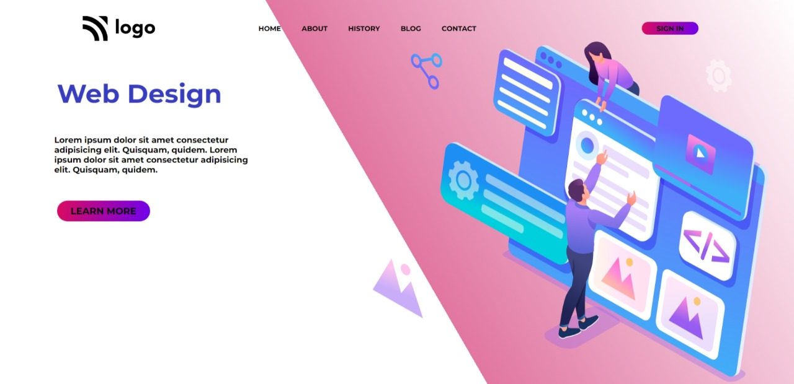

# Project-09-  Web Design Template
 ## Hey there ,  I am Amarjeet 
 I have built a template of HTML and CSS project using my core css skills 
 
 
 
 

 My Live Deployed Website Link:- [Click here !]()

 
 

 ## For making this project I spend almost 3 hours.

 ## What I learned from this project 
 - Most important thing which i learned from this projecy is about position and  .
 - also I explore about backgroun color and linear ingrediant .
  